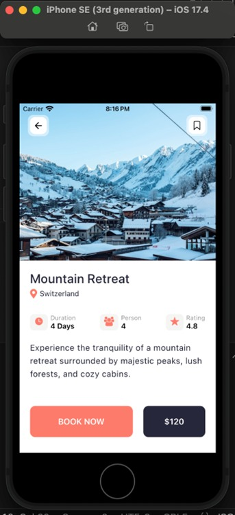

# TECH FOR MOBILE APPS

## Instructor: Dr William Akotam Agangiba

## Students

## Team-06
### Name: Sruthi SridharBopparthi
### Email: bopparsr@mail.uc.edu
### Name: Gali Sai Divakar Reddy
### Email: galisy@mail.uc.edu
### Name: Bheemreddy Vikhyath Reddy
### Email: bheemrvy@mail.uc.edu
## Repository Information
### Repository's URL: [https://github.com/Tech-For-Mobile-Apps-Final-Project-06/Final_Project](https://github.com/Tech-For-Mobile-Apps-Final-Project-06/Final_Project)
### This is a repository which is used to store all the codes related to the Final Project of Tech For Mobile APP

# FINAL PROJECT

In this assignment, we developed the travel app for the travel to destination where one can save, view and book stay using React Native in Visual Studio Code and provided the code in our repository. [https://github.com/Tech-For-Mobile-Apps-Final-Project-06/Final_Project](https://github.com/Tech-For-Mobile-Apps-Final-Project-06/Final_Project)

## Below is the image of the Code we done in Visual Studio Code

## Home Page
### Contains the LOGO, Notification button, Search, Catogory selection Options, with diferent destinations in Listing Form vertically and also when scrolled can see recommendations

## Navigation Bar
### In the navigation bar of the app we have home option, search option to find destination by name, bookmark option to save and view for later and  profile option to manage there profile as of their activities.

## Options
### When we select the any destination we get the details of the destination and payment option with other attributes associated to it and can bookmark from there too.

### HOW TO RUN

Open Visual Studio Code and click on Source Control (Ctrl+Shift+G) and click on Clone Repository, Copy the Repository Link and Open the Terminal(Ctrl+`) and then Use "npm install yarn or npm install" then "npm start" and then Click on desired way to view thw application.
